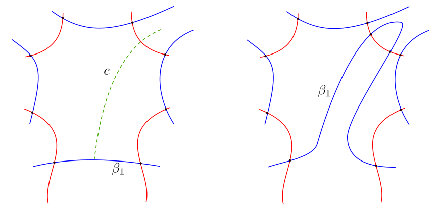

# nicepy

[](https://github.com/ludomorellato/nicepy/actions/workflows/tests.yml)
[](https://www.python.org/downloads/)
[](LICENSE)

A **Heegaard diagram** describes a 3-dimensional manifold by a surface carrying two
families of curves, drawn here in red and blue; the curves cut the surface into regions,
and everything one wants to compute about the manifold is read off those regions. The
catch is that the invariant of interest — Heegaard Floer homology — is defined by
counting holomorphic discs, which is not something a computer can do, *unless* every
region of the diagram is a bigon or a square. A diagram with that property is called
**nice**, and the Sarkar–Wang algorithm turns any diagram into a nice one by repeatedly
pushing the curves across the bad regions until none is left.

`nicepy` implements that algorithm. Give it a diagram, and it hands back a nice one along
with the data needed to compute the invariant.



*The basic move. The region on the left has eight sides, so it is bad; pushing the blue
curve β₁ along the dotted arc `c` splits it into smaller ones. The algorithm chooses
which move to make, and where, so that the diagram measurably improves each time.*

## Installing

```
git clone https://github.com/ludomorellato/nicepy
cd nicepy
pip install -r requirements.txt
```

Python 3.9 or newer. `numpy` is the only dependency.

## Running it

```
python main.py inputs/tangles/pretzel_tangle.txt --output out.txt
```

Takes about a second, and prints:

```
The algorithm worked!

We were able to nicefy the diagram given in inputs/tangles/pretzel_tangle.txt

Number of generators of the diagram: 82
Number of cycle of the algorithm: 2
Number of regions of the diagram: 30

Nicefied diagram written to out.txt
```

Two cycles of the algorithm turned the 14 regions of the input into 30 regions, every one
of them a bigon or a square. `out.txt` holds the nicefied diagram, the diagram after each
cycle, and — for a tangle diagram — the input string for the `PQM.m` Mathematica package
that computes the invariant.

Four more examples live in `inputs/`, and what each should produce is committed under
`examples/expected_output/`. `--verbose` narrates the run, and `python main.py --help`
lists the rest.

## Input format

One value per line. Using [`inputs/tangles/pretzel_tangle.txt`](inputs/tangles/pretzel_tangle.txt):

```
tangle
8
22
[[1,11,9,2], [4,13,14,10,12,3], ... , [20,16,15,5,6,17]]
[[1,0], [3,1]]
[2,4,6,8]
[2,3,6,7]
```

| line | meaning |
| --- | --- |
| 1 | Kind of diagram: `normal`, `tangle` (a 4-ended tangle) or `rational` (built from rational tangles rather than given region by region). |
| 2 | Number of points on the boundary. `0` for a closed diagram. |
| 3 | Total number of intersection points, boundary points included. |
| 4 | The regions. Each is the list of the corners of one region, read from inside it **anticlockwise**, and starting so that **the first two labels are the endpoints of an alpha edge**. `[1,11,9,2]` is a square; a region with more than four entries is *bad*, and is what the algorithm has to remove. Every edge must appear exactly twice across the whole list, once in each direction — the program checks this and tells you which edge is wrong. |
| 5 | Where the basepoints go, as `[region, side]` pairs: `[1,0]` is the multiplicity zero region on the front of the 4-punctured sphere, `[3,1]` one on the back. Needed even when the program tries all sixteen placements, since it is what tells front from back. For a `normal` diagram this is a plain list of regions instead. |
| 6 | One boundary point per alpha arc, in the order that names the four arcs `a`, `b`, `c`, `d` when the invariant is computed. Tangle diagrams only. |
| 7 | The four boundary points, in the order that assigns them the Alexander gradings (1,0), (−1,0), (0,1), (0,−1). Tangle diagrams only. |

Points are numbered with the boundary points first, anticlockwise around each
boundary component, so a region is a boundary region exactly when one of its corners
is a boundary point. The diagram itself must satisfy three conditions, which are what
step 1 of the algorithm produces and which the program relies on:

- every alpha curve meets at least one beta circle, and every beta circle meets at
  least one alpha curve;
- every region is a disc;
- every alpha and beta circle carries at least three intersection points — with one
  or two, an edge is not determined by its endpoints. The program checks this one and
  tells you which circle is at fault.

A `rational` diagram is described differently — by the tangles to build and how to glue
them — since the program constructs the regions itself. See
[`inputs/rational/sum_of_rational_tangles.txt`](inputs/rational/sum_of_rational_tangles.txt).

## Project layout

```
main.py                  command line interface
classes/                 Heegaard_diagram and Region: the data the algorithm works on
functions/               reading the input, building a diagram, measuring how bad it is
  pipeline.py            nicefy(): the whole run, from input file to nicefied diagram
algorithm_functions/     the Sarkar-Wang algorithm and the moves it applies
tangles_functions/       4-ended tangles: gluing, closing up, and the invariant's input
inputs/                  five example diagrams
examples/expected_output/  what each of them produces
tests/                   pytest suite
docs/documentation.pdf   the thesis this implements
```

## Testing

```
pip install -r requirements-dev.txt
pytest
```

32 tests, about 12 seconds. They run all five examples end to end and check the
postcondition of the algorithm directly: every region not containing a basepoint must
have at most four sides.

## Reference

Sarkar, S. and Wang, J., *An algorithm for computing some Heegaard Floer homologies*,
Annals of Mathematics **171** (2010), 1213–1236.
<https://doi.org/10.4007/annals.2010.171.1213>

The derivation, and the details of this implementation, are in Appendix A of the master's
thesis *Implementing the Sarkar–Wang Nicefication Algorithm* by Ludovico Morellato,
included here as [`docs/documentation.pdf`](docs/documentation.pdf).

## License

[AGPL-3.0](LICENSE).

## Citing this work

If you find this program useful, please make sure to cite it in the following way:

```
Ludovico Morellato, nicepy, a program to nicefy Heegaard diagrams, https://github.com/ludomorellato/nicepy, <date>. 
```

Bibtex (requires `\usepackage{hyperref}`).

```
@misc{nicepy,
    author = {Morellato, Ludovico},
    howpublished = {URL: \url{https://github.com/ludomorellato/nicepy}},
    month = {<current month>},
    year = {<current year>},
    title = {\texttt{nicepy}, a program to nicefy Heegaard diagrams},
    shorthand = {\texttt{nicepy}}
}
```
